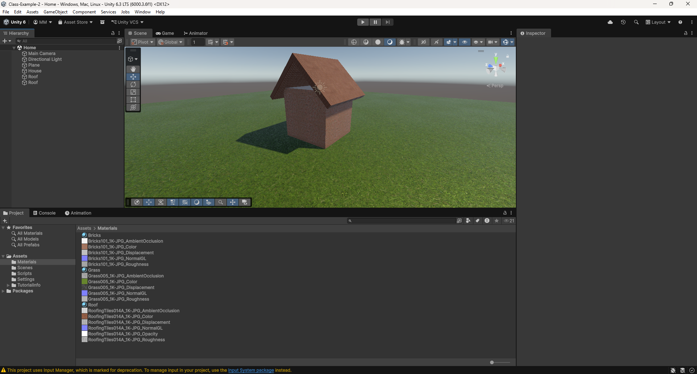

# Activity 2/10

Today, we will be exploring Materials for 3D objects.

## Setup

Open the Unity project Class-Example-2.

## Scene Setup

Create a new scene, and build a house. We will also be introducing materials to add texture to our scene.

As a side note, there will be a hole in the roof, as we do not have a triangle to fill the gap. We can use planes and cubes to build the rough shape regardless.

## Material Creation

We will be making three materials: a brick wall, a grass floor, and a roof tile texture.

1. Download the ZIP file with all the texture images on Google Classroom.
2. Extract the files from the ZIP file.
3. Create a new folder called "Materials" in the Unity Editor in the Assets folder.
4. Drag all the image files into the Materials folder.
5. Create a new material in the Materials folder.
6. Select the texture files ending in "NormalGL" and change the Texture Type to "Normal map".
7. Click on the material to open it in the inspector.
8. Drag the images to the corresponding surface input, based on file name.
    - The file named "Color" is the Base Map.
    - The file named "Roughness" is the Metallic Map.
    - The file named "NormalGL" is the Normal Map.
    - The file named "Displacement" is the Height Map.
    - The file named "AmbientOcclusion" is the Occlusion Map.
9. Attach the materials to the GameObjects in our scene.
10. Adjust the values of your material and the tiling until the scene looks reasonable.

In the end, submit a screenshot of your scene with all three materials in use. An example is shown below.

## Texture Sources

If you are interested, these textures are from [https://ambientcg.com/](https://ambientcg.com/). All textures from here are free and public domain, so you are welcome to use them for your projects.

The ones I selected are these:

- Bricks: [https://ambientcg.com/view?id=Bricks101](https://ambientcg.com/view?id=Bricks101)
- Grass: [https://ambientcg.com/view?id=Grass005](https://ambientcg.com/view?id=Grass005)
- Roof: [https://ambientcg.com/view?id=RoofingTiles014A](https://ambientcg.com/view?id=RoofingTiles014A)