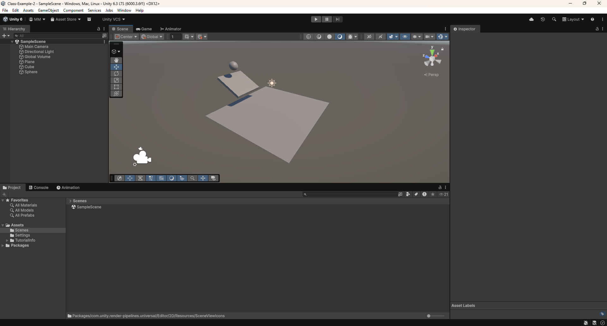
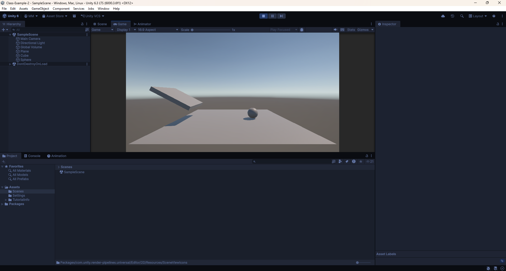

# Class-Example-2

Please download a copy of this Unity project on your machine. I set up all the lab computers with the new Unity 6000.3.6f1 version, so there should not be any issues with incompatibilities.

## Installation:

Since we are all on the same version of Unity now, the set up should be a bit quicker, and hopefully with less warnings.

1. Go to https://github.com/matt-merritt-phs/Class-Example-2
2. Select the green "Code" button, then select "Download ZIP"
3. Open File Explorer, and navigate to Downloads
4. Select "Extract all", and put the files somewhere you will remember
5. Open Unity Hub
6. Under "Projects", select the "Add" button
7. Select "Add project from disk"
8. Find the inner folder from the unzipping process earlier (should be "Class-Example-2-master", with the "Assets" folder and a bunch more inside)

## Activity 2: Building a Scene

1. Create a new scene in your scenes folder, called "Activity2"
2. From the list of 3D objects, add a Plane for our floor
3. Add a Cube that will act as a ramp
4. Rotate and lengthen the cube so that it has a wider surface and a slope
5. Add a Sphere that starts above our ramp

Submit a screenshot of your Unity editor with the three GameObjects. An example is included below.

## Activity 3: Introduction to Components

1. Select the Sphere in the heirarchy
2. In the Inspector on the right, at the bottom, click "Add Component"
3. In the dropdown, search for "Rigidbody" and click it to add one to our sphere
4. In the top of the editor, press play and observe what happens
5. Reposition the camera in the scene so that you have a better angle of the sphere motion

Submit a screenshot of your Unity editor with the sphere in motion after you press play. An example is included below.

