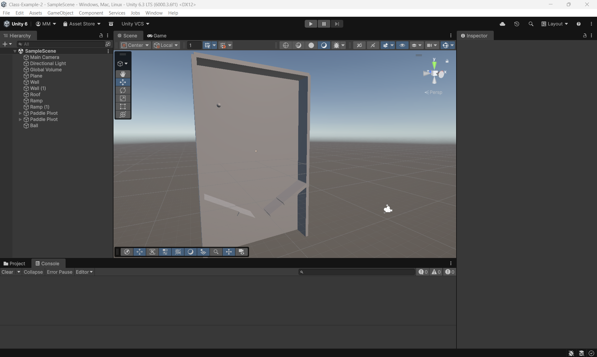

# Class-Example-2

Please download a copy of this Unity project on your machine. I set up all the lab computers with the new Unity 6000.3.6f1 version, so there should not be any issues with incompatibilities.

## Installation:

Since we are all on the same version of Unity now, the set up should be a bit quicker, and hopefully with less warnings.

1. Go to https://github.com/matt-merritt-phs/Class-Example-2
2. Select the green "Code" button, then select "Download ZIP"
3. Open File Explorer, and navigate to Downloads
4. Select "Extract all", and put the files somewhere you will remember
5. Open Unity Hub
6. Under "Projects", select the "Add" button
7. Select "Add project from disk"
8. Find the inner folder from the unzipping process earlier (should be "Class-Example-2-master", with the "Assets" folder and a bunch more inside)

## Activity 2: Building a Scene

1. Create a new scene in your scenes folder, called "Activity2"
2. From the list of 3D objects, add a Plane for our floor
3. Add a Cube that will act as a ramp
4. Rotate and lengthen the cube so that it has a wider surface and a slope
5. Add a Sphere that starts above our ramp

Submit a screenshot of your Unity editor with the three GameObjects. An example is included below.

## Activity 3: Introduction to Components

1. Select the Sphere in the heirarchy
2. In the Inspector on the right, at the bottom, click "Add Component"
3. In the dropdown, search for "Rigidbody" and click it to add one to our sphere
4. In the top of the editor, press play and observe what happens
5. Reposition the camera in the scene so that you have a better angle of the sphere motion

Submit a screenshot of your Unity editor with the sphere in motion after you press play. An example is included below.

# Day 2 (2/5/2026) - Pinball Setup

First, we will need to change the Input system to use the old model instead of the new one that came with Unity 6. The new input requires us to configure a bunch of actions and events, and we only need basic input for now.

## Part 1 - Changing the Input System

1. Open your Unity Project
2. On the top ribbon, look under "Edit"
3. Select "Project Settings" from the bottom
4. Navigate to the page called "Player"
5. Expand "Other Settings"
6. Under "Configuration" in the middle, change "Active Input Handling" from "Input System Package (New)" to "Input Manager (Old)"
7. Restart Unity when prompted
8. Press the play button, and restart the Unity editor when prompted

There will not be any noticeable changes yet, but we will be able to test with our scripts in a second.

## Part 2 - Importing the Script

1. Go to Google Classroom, and look for the most recent resource called "Pinball Paddle Scripts"
2. Download the "Paddle.cs" and "Clicking.cs" script
3. In the Unity Editor, in the Project window at the bottom, add a folder to the "Assets" folder called "Scripts"
4. Open a file explorer window with your downloads folder
5. Drag the "Paddle.cs" and "Clicking.cs" file from your downloads to the new scripts folder in Unity

After doing this, you should be able to add the Paddle and Clicking scripts just like any other component in the heirarchy. You can also drag the script onto a GameObject to add it.

## Part 3 - Testing Everything so Far

1. Add the "Clicking" script as a component to a GameObject in your scene (I recommend adding this to the ball)
2. In the bottom of the Unity Editor, switch from the "Project" tab to the "Console" tab
3. Press the play button at the top of the Unity Editor
4. Click with the left and right mouse button, and confirm that messages are appearing in the console

If you do not see messages in the console, there could be an issue with the swap to the old input system, or you could have missed a step when working with the scripts.

## Part 4 - Building out the Pinball Scene

1. Begin building out the environment using 3D shapes, including the shapes that will act as the paddles
2. Add two empty GameObjects to represent the pivot points of the paddles, and move it to the desired location
3. Drag the GameObject for the 3D shape of the paddle under the corresponding pivot GameObject to make it a child
4. Add a Rigidbody component to the paddle pivot parent GameObject, and make the Rigidbody kinematic
5. Add the Paddle script to the paddle pivot parent GameObject, and configure the settings
6. Adjust the settings of the rigidbody and paddle script until you have a responsive swing

I have included a picture of my pinball scene as an example. You are encouraged to do something different, and experiment with different layouts.

